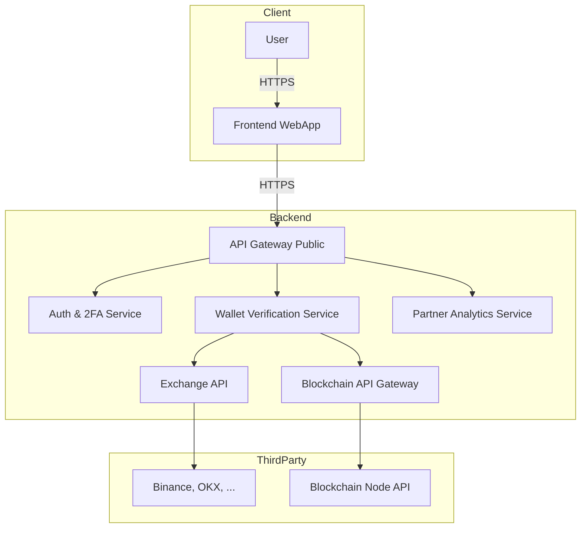
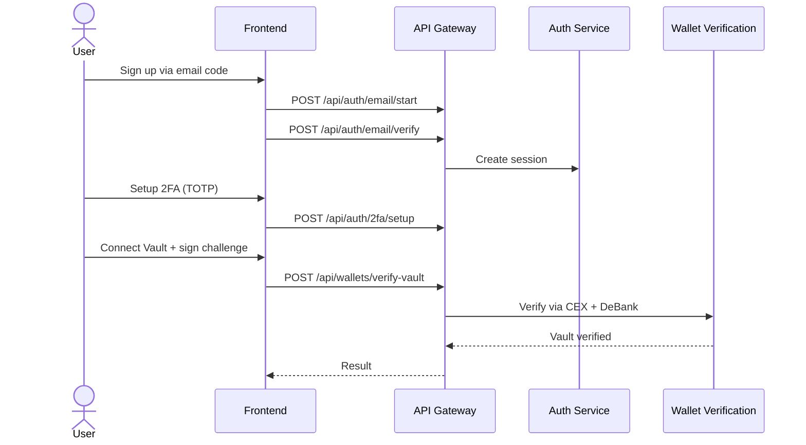
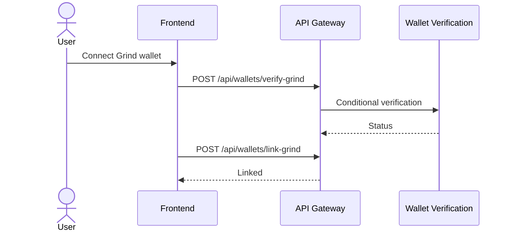
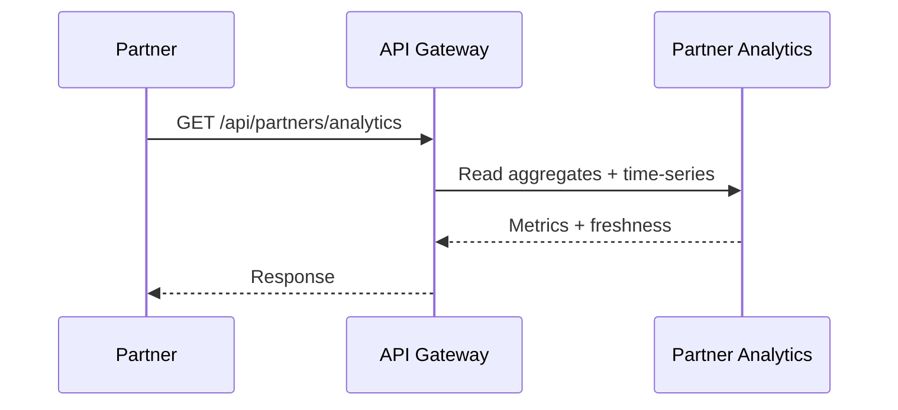

# SafeDrop Workflow & Architecture

> **Acting as:** `docs-engineer` + `product-manager`
> **Diagram Source:** `sd.drawio`

---

## System Overview

SafeDrop is a Web3 security platform that verifies ownership (Vault + Grind) while protecting airdrop campaigns from Sybil/drainer risk.
The current flow adds email-code sign-up, immediate 2FA setup, and partner analytics.

---

## Architecture (Mermaid)

---

## User Flow (Updated)

1. Sign in via Google or wallet (linked accounts only) or sign up via email code.
2. After sign-up, user completes 2FA setup (Google Authenticator).
3. 2FA required for link/add/change actions (vault/burner/social/security).
4. Vault verification: signature challenge -> CEX API -> DeBank first 3 deposits.
5. Grind verification: must have at least 1 inbound deposit -> CEX API proof.
6. Dual-signature linking (Vault + Grind).
7. Socials linking + optional passkey/biometric SSO.

---

## Flow 1: Auth + Vault Verification

---

## Flow 2: Grind Verification + Linking

---

## Flow 3: Partner Analytics

---

## API Endpoints (Current)

### Auth & Identity
- POST /api/auth/email/start
- POST /api/auth/email/verify
- POST /api/auth/oauth/google
- POST /api/auth/wallet/challenge
- POST /api/auth/wallet/verify
- POST /api/auth/2fa/setup
- POST /api/auth/2fa/verify
- POST /api/auth/2fa/disable

### Wallet Verification
- POST /api/wallets/verify-vault
- POST /api/wallets/verify-grind
- POST /api/wallets/link-grind
- POST /api/wallets/verify-vault-recovery
- POST /api/wallets/relink-grind

### Partner API
- POST /api/partners/register
- POST /api/campaigns
- GET /api/campaigns/:id
- PATCH /api/campaigns/:id/close
- GET /api/partners/analytics

---

## Exchanges & Chains

- **Exchanges:** Binance, OKX, Bybit, Bitget, BingX, Gate, Kucoin, MEXC, Kraken
- **Chains:** EVM (Ethereum + L2s), Solana
