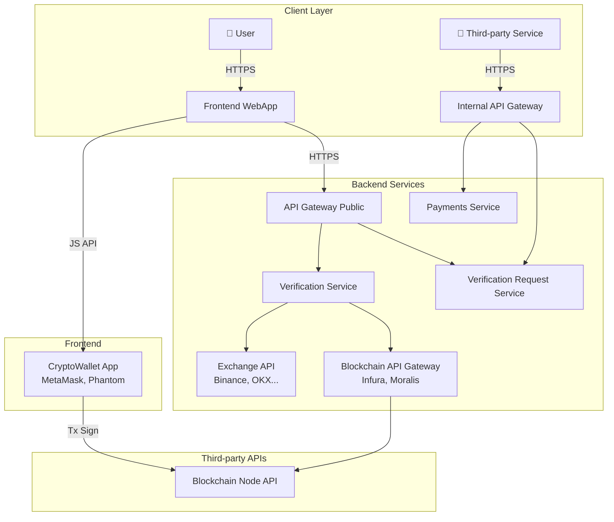
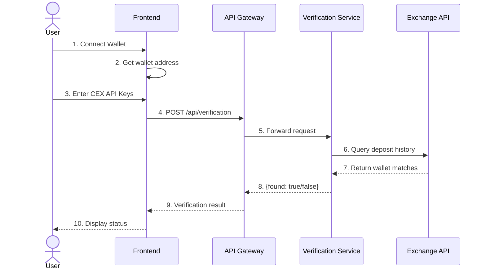
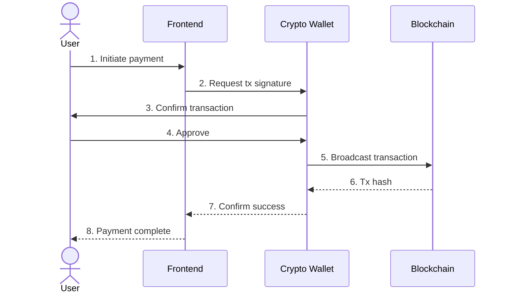
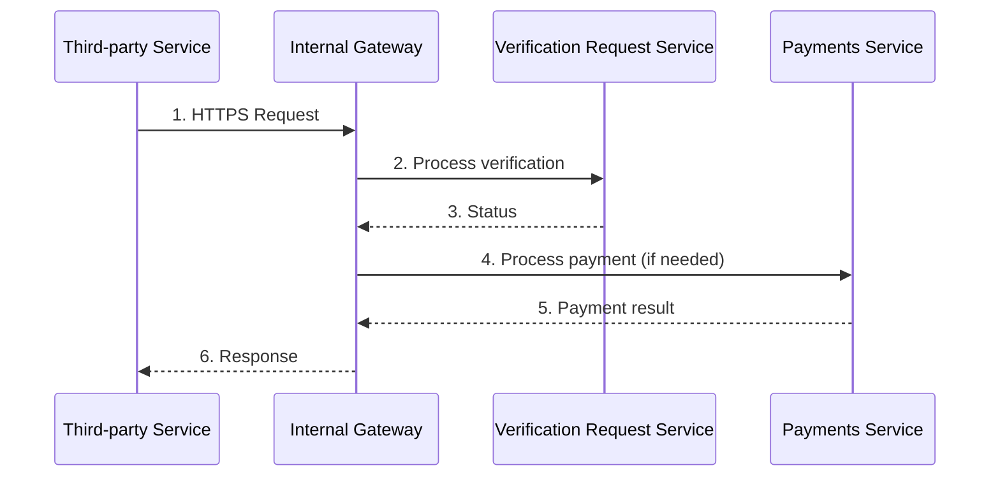

# SafeDrop — Архитектура и Рабочий Процесс

> **Acting as:** `docs-engineer` + `product-manager` агенты
> **Источник:** [sd.drawio](file:///c:/Users/karte/Downloads/safedrop-app/sd.drawio)

---

## Обзор Системы

SafeDrop — платформа для безопасной верификации и защиты airdrop-участников от Sybil-атак и drainer-скамов.



---

## Компоненты Системы

### 1. Client Layer (Уровень Клиента)

| Компонент | Описание | Протокол |
|-----------|----------|----------|
| **User (Client)** | Конечный пользователь приложения | HTTPS |
| **Frontend (WebApp)** | Next.js 16 + React 19 приложение | HTTPS, JS API |
| **Third-party Service** | Внешние интеграции (партнёры) | HTTPS |

### 2. Backend Layer

| Компонент | Описание | Связь |
|-----------|----------|-------|
| **API Gateway (Public)** | Публичный входной шлюз | Frontend → Backend |
| **API Gateway (Internal)** | Приватный шлюз для партнёров | Third-party → Backend |
| **Verification Service** | Верификация CEX аккаунтов | → Exchange API |
| **Verification Request Service** | Обработка запросов верификации | API Gateways |
| **Payments Service** | Обработка платежей | Internal Gateway |

### 3. Third-party Integrations

| Сервис | Примеры | Назначение |
|--------|---------|------------|
| **CryptoWallet App** | MetaMask, Phantom | Подпись транзакций |
| **Exchange API** | Binance, OKX, Bybit... | Верификация CEX |
| **Blockchain API Gateway** | Infura, Moralis | RPC endpoints |
| **Blockchain Node API** | Ethereum, Solana | Запись транзакций |

---

## Потоки Данных

### Flow 1: Верификация Пользователя



### Flow 2: Транзакция (Платёж)



### Flow 3: Third-party Integration (B2B)



---

## Сетевая Архитектура

```
┌─────────────────────────────────────────────────────────────────┐
│                         PUBLIC NETWORK                          │
│  ┌──────────┐    ┌──────────────┐    ┌────────────────────┐    │
│  │  User    │───→│   Frontend   │───→│  API Gateway       │    │
│  └──────────┘    │   (WebApp)   │    │  (Public)          │    │
│                  └──────┬───────┘    └─────────┬──────────┘    │
│                         │                      │                │
│  ┌──────────────────────┴──────────────────────┴─────────────┐ │
│  │                     PRIVATE NETWORK                        │ │
│  │  ┌─────────────────┐    ┌─────────────────────────────┐   │ │
│  │  │ Third-party     │───→│ API Gateway (Internal)      │   │ │
│  │  │ Service         │    └──────────────┬──────────────┘   │ │
│  │  └─────────────────┘                   │                  │ │
│  │                                        ▼                  │ │
│  │  ┌───────────────────────────────────────────────────┐   │ │
│  │  │                   BACKEND                          │   │ │
│  │  │  ┌─────────────────┐   ┌──────────────────────┐   │   │ │
│  │  │  │ Verification    │   │ Verification Request │   │   │ │
│  │  │  │ Service         │   │ Service              │   │   │ │
│  │  │  └────────┬────────┘   └──────────────────────┘   │   │ │
│  │  │           │            ┌──────────────────────┐   │   │ │
│  │  │           │            │ Payments Service     │   │   │ │
│  │  │           │            └──────────────────────┘   │   │ │
│  │  └───────────┼───────────────────────────────────────┘   │ │
│  └──────────────┼───────────────────────────────────────────┘ │
│                 │                                              │
│  ═══════════════│══════════════════════════════════════════   │
│                 │          THIRD-PARTY SERVICES                │
│                 ▼                                              │
│  ┌──────────────────────┐  ┌──────────────────────────────┐   │
│  │ Exchange API         │  │ Blockchain API Gateway       │   │
│  │ (Binance, OKX...)    │  │ (Infura, Moralis)            │   │
│  └──────────────────────┘  └───────────────┬──────────────┘   │
│                                             │                  │
│  ┌──────────────────────┐  ┌───────────────▼──────────────┐   │
│  │ CryptoWallet App     │  │ Blockchain Node API          │   │
│  │ (MetaMask, Phantom)  │──│                              │   │
│  └──────────────────────┘  └──────────────────────────────┘   │
└─────────────────────────────────────────────────────────────────┘
```

---

## Ключевые API Endpoints

### POST /api/verification

Проверка соответствия кошелька CEX-аккаунту.

**Request:**
```json
{
  "exchange": "binance",
  "key": "API_KEY",
  "secret": "API_SECRET",
  "passphrase": "PASSPHRASE",
  "wallet": "0x..."
}
```

**Response:**
```json
{
  "found": true
}
```

---

## Поддерживаемые Интеграции

### Биржи (CEX)
| Exchange | Status |
|----------|--------|
| Binance | ✅ Active |
| OKX | ✅ Active |
| Bybit | ✅ Active |
| KuCoin | ✅ Active |
| Bitget | ✅ Active |
| MEXC | ✅ Active |
| Kraken | ✅ Active |
| BingX | ✅ Active |
| Gate.io | ❌ Disabled |

### Блокчейны
| Chain | Type | Status |
|-------|------|--------|
| Ethereum | EVM | ✅ |
| BSC | EVM | ✅ |
| Polygon | EVM | ✅ |
| Arbitrum | EVM | ✅ |
| Optimism | EVM | ✅ |
| Base | EVM | ✅ |
| Linea | EVM | ✅ |
| Solana | Non-EVM | ✅ |

---

## See Also

- [Project Overview](./project-overview.md)
- [Architecture - Frontend](./architecture-frontend.md)
- [Architecture - Backend](./architecture-backend.md)
- [API Contracts](./api-contracts.md)
